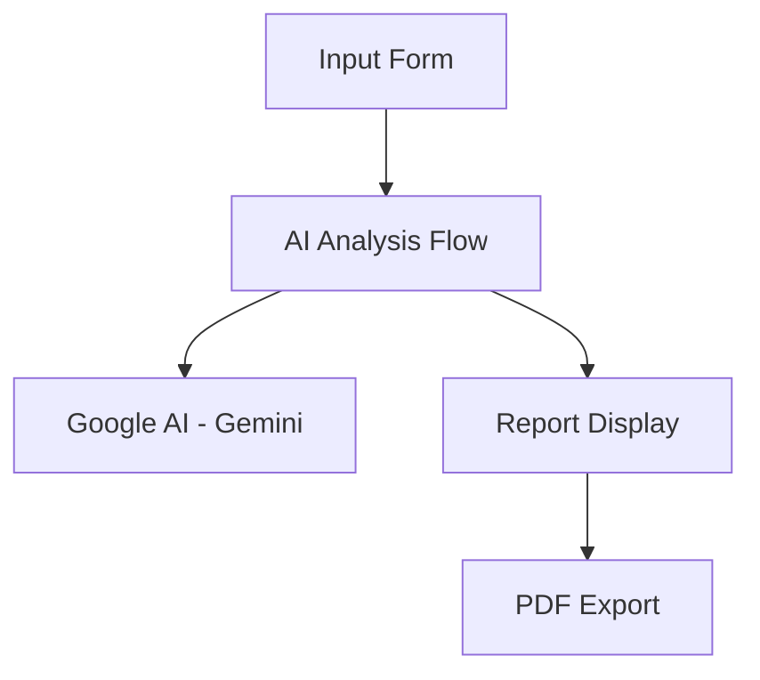

# Design Document

## Overview

The Amazon Basics Market Scout is a simple, single-page application that generates comprehensive market analysis reports using AI. Users enter a product category, the system generates a detailed business report with opportunities, competition analysis, and financial projections, then displays results with PDF export capability.

## Architecture

### Simple Architecture



### Technology Stack

**Frontend:**
- Next.js with existing components
- React with TypeScript
- Tailwind CSS for styling
- Recharts for simple charts

**AI Processing:**
- Firebase Genkit flows
- Google AI (Gemini) for analysis
- No external APIs - AI generates realistic mock data

**Export:**
- jsPDF for PDF generation
- html2canvas for chart rendering

## Components and Interfaces

### Simple Data Models

```typescript
// Market Analysis Report
export interface MarketAnalysisReport {
  category: string;
  executiveSummary: string;
  opportunities: MarketOpportunity[];
  competitorAnalysis: CompetitorInsight[];
  financialProjections: FinancialAnalysis;
  recommendations: string[];
  confidenceScore: number;
  generatedAt: Date;
}

// Market Opportunity
export interface MarketOpportunity {
  name: string;
  description: string;
  tam: number; // Total Addressable Market in millions
  estimatedCost: number;
  suggestedPrice: number;
  profitMargin: number;
  difficultyScore: number; // 1-10
  timeToMarket: number; // months
}

// Competitor Insight
export interface CompetitorInsight {
  name: string;
  marketShare: number;
  priceRange: string;
  strengths: string[];
  weaknesses: string[];
}

// Financial Analysis
export interface FinancialAnalysis {
  totalMarketSize: number;
  estimatedRevenue: number;
  breakEvenPoint: number;
  roi: number;
  riskFactors: string[];
}
```

### AI Flow

```typescript
// Single Market Analysis Flow
export interface MarketAnalysisFlow {
  input: {
    category: string;
  };
  output: {
    report: MarketAnalysisReport;
  };
}
```

## Components

### Main Components

1. **MarketAnalysisForm** - Simple input form for product category
2. **MarketAnalysisReport** - Display component for analysis results
3. **ReportExport** - PDF generation and download
4. **LoadingSpinner** - Progress indicator during analysis

## Error Handling

Simple error handling with user-friendly messages and retry options.

## Testing Strategy

Basic unit tests for AI flows and components.

## Deployment

Deploy to Vercel/Netlify with environment variables for Google AI API key.